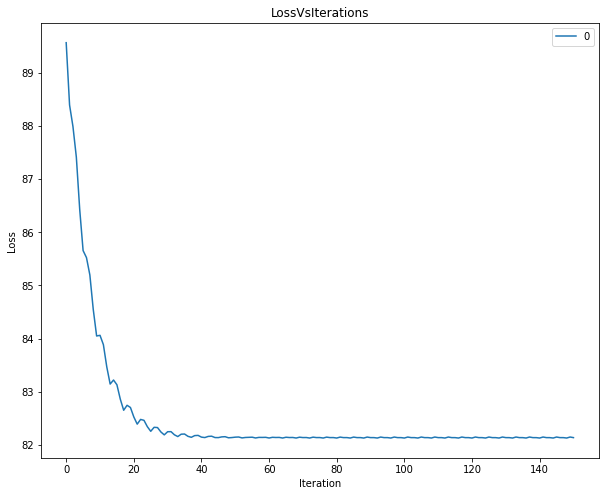
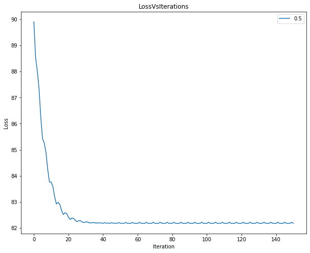
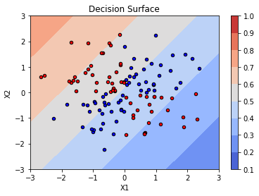
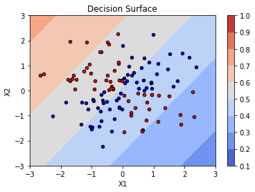

# Question 1

## Results:

* Fit intercept= True , lr_type= constant , Batch size= 30, iterations = 150, lambda= 0 
    * Train Accuracy:  60.0
* Fit intercept= True , lr_type= constant , Batch size= 30, iterations = 150, lambda= 0 
    * Test Accuracy:  57.5
* Fit intercept= True , lr_type= constant , Batch size= 30, iterations = 150, lambda= 0.5 
    * Train Accuracy:  59.17
* Fit intercept= True , lr_type= constant , Batch size= 30, iterations = 150, lambda= 0.5 
    * Test Accuracy:  55.0

-> From the above results we can conclude that the prediction accuracy decreases with increases lambda as lambda decreases the values of highest cofficients and hence the prediction reduces.

## Loss vs Iterations

lambda = 0           |  lambda = 0.5
:-------------------------:|:-------------------------:
  |  

 ## Conclusion
* From the above plots we observe that the loss vs iterations is almost similar for both the lambda but the loss is smoother in case of lambda 0.5.

##  Decision Surface

lambda = 0           |  lambda = 0.5
:-------------------------:|:-------------------------:
  |  

## Conclusion
* For lambda 0.5 we can see that the prediction accuracy decreases a little.
* We have shown differnet line divisions which shows the increasing probability of classes in opposite direction.
* We have only one single decision surface hence we can conclude that the logistic regression performs poor on XOR dataset. 

-> 